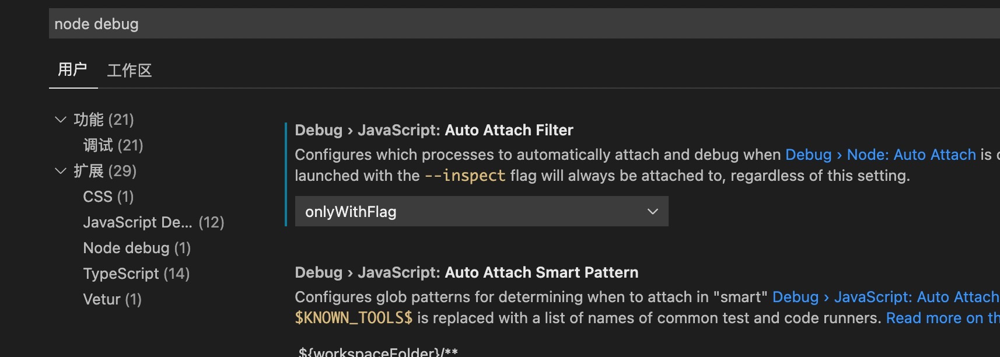
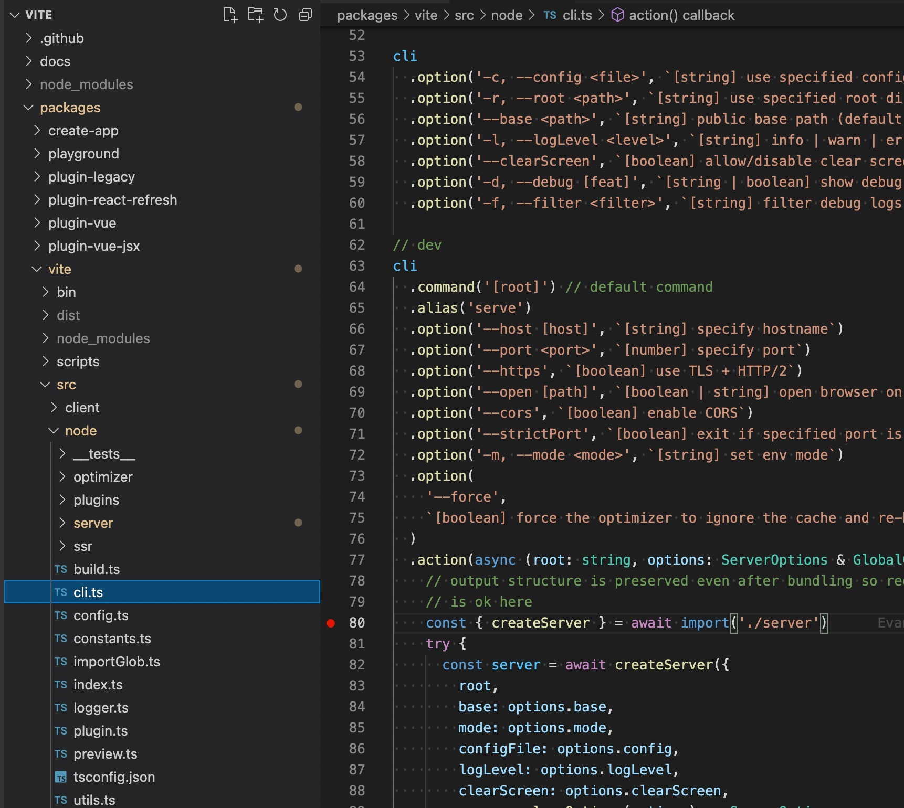

# vite源码分析

### 一、准备工作

####  1. Vs Code配置调试

打开 `Preferences > Settings`，在搜索框中输入 `node debug`。在 `Extensions` 选项卡下应该会有一个叫 `Node debug` 的扩展。在这里点击第一个方框： **Debug > Node: Auto Attach**，然后设置下拉框的选项为 `onlyWithFlag`。



#### 2. 启动一个react模板的项目

```shell
yarn create @vitejs/app vite-demo --template react-ts
cd vite-demo
yarn
yarn dev
```

#### 3. 下载vite仓库 创建软链接

```shell
git clone git@github.com:vitejs/vite.git

cd vite && yarn

cd packages/vite && yarn build && yarn link

yarn dev

```

#### 4. vite初始化一个vite-demo项目，并连接vite软连接

```shell
cd vite-demo
yarn link vite
```

#### 5. 修改vite-demo启动脚本

```json
{
  "version": "0.0.0",
  "scripts": {
    "dev": "vite",
    "build": "tsc && vite build",
    "debug": "node --inspect node_modules/vite/dist/node/cli.js",
    "serve": "vite preview"
  },
  "dependencies": {
    "react": "^17.0.0",
    "react-dom": "^17.0.0"
  },
  "devDependencies": {
    "@types/react": "^17.0.0",
    "@types/react-dom": "^17.0.0",
    "@vitejs/plugin-react-refresh": "^1.3.1",
    "typescript": "^4.3.2",
    "vite": "^2.3.7"
  }
}
```

#### 6. 在vite仓库代码dev入口，打上断点进行调试

> * 在packages/vite/src/node/clu.ts打上断点
> * 在vite-demo执行npm run debug



### 二、源码分析（server创建过程）

```ts
// src/node/cli.ts 
const { createServer } = await import('./server')
 try {
   const server = await createServer({
     root,
     base: options.base,
     mode: options.mode,
     configFile: options.config,
     logLevel: options.logLevel,
     clearScreen: options.clearScreen,
     server: cleanOptions(options) as ServerOptions
   })
   await server.listen()
 } catch (e) {
   createLogger(options.logLevel).error(
     chalk.red(`error when starting dev server:\n${e.stack}`)
   )
   process.exit(1)
 }
```

